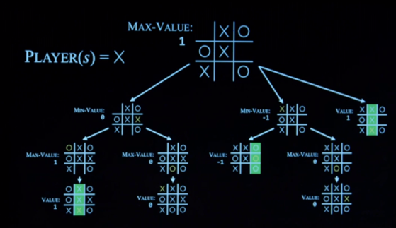
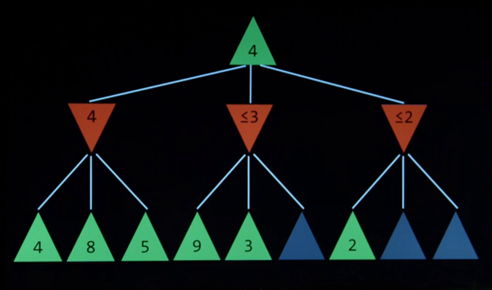

# Search

Maze / Number finding / Driving Directions

## Types of Search

- Uniformed Search
  : Search Strategy that uses no problem specific knowledge
  - [Depth First Search](#stack-frontier)
  - [Breadth First Search](#queue-frontier)
- Informed Search
  : Search strategy that uses problem specific knowledge to find solutions more efficiently.
  - [Greedy Best-First Search](#greedy-best-first-search)
  - [A(\*) Search](#a-star-search)
  - [Adverseral Search](#adverseral-search)

---

- Agents
  : entity that perceives its environment and acts upon that environment.
- State
  : A configuration of the agent in its environment.
- Initial State
  : The state where the agents begins.
- Actions
  : choices made in a state.
  - ACTIONS(_s_) returns the set of actions that can be executed in state(_s_).
- Transition Model
  : RESULTS(_s,a_) returns the state resulting
  from performing ACTIONS(_a_) in a STATE(_s_).
- State Space
  : The state of all states reachable from the initial state by any
  sequence of actions.
- Goal Tests
  : Way to determine whether a given state is a good state.
- Path Cost
  : Numerical cost associated with a given path to get to goal state.

## Approaching a search problems

- Initial State
- Actions
- Transition Models
- Goal Test
- Path Cost functions

- Node: A data structure that keeps track of;

  - State
  - Parent (Which node it came from)
  - An action (What action did it take to arrive in this mode)
  - A path cost.

- Frontier: The possible futures of the node.

### Approach

1. Start with a frontier that contains the initial state
2. Repeat:
   1. If frontier is empty --> No solution.
   2. Remove a node from the frontier.
   3. If node contains goal state, return solution.
   4. Expand nodes, adding resulting node to the frontier if they have not
      been explored

---

- Stack: Last in first out data type
  - Explore the latest added node
  - Depth First Search: Go as deep as possible, then backing out if no results.
    - Might not find the optimal path.
- Queue: First in first out data type
  - Explore the first added node)
  - Breadth first search.
    - Will find the optimal path, but may cost more memory.

---

### Stack-frontier

```python
class Node():
  def __init__(self,state,parent,action):
    self.state = state
    self.parent = parent
    self.action = action
class Stackfrontier():
  def __init__(self):
    self.frontier = []

  def add(self,node):
    self.frontier.append(node)
    #Appends adds the last item viewed

  def contains_state(self,state):
    return any(node.state == state for node in self.frontier)

  def empty(self):
      return len(self.frontier) == 0

  def remove(self):
    if self.emtpy():
      raise Exception("emtpy frontier")
    else:
      # [-1] gives the last item in the list
      node = self.frontier[-1]
      self.frontier = self.frontier[:-1] #removes the last item on the list
      return node
```

---

### Queue-Frontier

```python
class QueueFrontier(StackFrontier):

  def remove(self):
    if self.empty():
      raise Exception("empty frontier")
    else:
        node = self.frontier[0] #gives ths first item in the list
        self.frontier = self.frontier[1:]
        return node
```

---

### Solve-function

```python
# keep track of number of states explored
self.num_explored = 0

# Initialize frontier to just the starting position
start = Node(state=self.start, parent=None, action=None)
frontier = StackFrontier() #DFS
frontier.add(start)

# Initialize and empty explored set
self.explored = set()

# Keep looping until solution found
while True:

  #If nothing left in frontier, then no path
  if frontier.empty():
      raise Exception("no solution")

  # Choose a node from the frontier
  node = frontier.remove()
  self.num_explored +=1

  #If node is the goal, then we have solution
  if node.state == self.goal:
    actions = []
    cells = []

    #Follow parent nodes to find solution
    while node.parent is not None:
      actions.append(node.action)
      cells.append(node.state)
      node = node,parent
    actions.reverse()
    cells.reverse()
    self.solution = (actions, cells)
    return

  # Mark node as explored
  self.explored.add(node.state)

  # Add neighbors to frontier
  for action, state in self.neighbors(node.state):
    if not frontier.contains_state(state) and state not in self.explored:
      child = Node(state=state, parent=node, action=action)
      frontier.add(child)
```

---

## Informed Search

### Greedy-best-first search

Search Algorithm that expands the node that is closest to
the goal as estimated by a heuristic function. h(n)

- Manhattan distance
  : The distance between two points measured along axis at right angles.
  In a plane with $p_1$ at $(x_1,y_1)$ and $p_2$ at $(x_2,y_2)$, it is $|x_1-x_2|+|y_1-y_1|$
  > When exploring GBFS, algorithm will choose which node to select at a fork based
  > on a heuristic function that is lower.
  > (Needs a good heuristic)

---

### A-Star-Search

Search Algorithm that expands node with the lowest value of g(n) +h(n)

- g(_n_): cost to reach node
- h(_n_): estimated cost to reach goal (heuristic)
  > $g(n) + h(n)$ is the estimated travel cost from the initial state to goal state.
  > The program will rather take fewer steps to be at a certain distance than
  > take many steps to be about the same distance away from the goal.
  >
  > > A\* search is only optimal if;
      - h(n) never over estimates the true cost **AND**
      - h(n) is consistent: For every node n and successor n' with steps cost c,
  $h(n) \leq h(n) + c$
  > h(n) needs to be either spot on or underestimate.

---

### Adverseral-Search

Search Algorithm trying to win a game,
whereby there is an "opponent" trying to make it not win

- _e.g._ Chess, Tic-Tac-Toe

#### Minimax

Assigning certain endstate with a number,
each party tries to achieve the max/min score.

```TicTacToe
    | o |         o | x | o       x |   |
-------------   -------------   -------------
    | o |         o | x | x         | x |
-------------   -------------   -------------
    | o |         x | o | x         |   | x
     (-1)            (0)             (1)
```

For the O player, trying to acheive the minimum score of -1, where he wins.
If not possible,it would have to choose between 0 or 1.
Since 0 is smaller, it would choose to end in a draw.

##### Game

- $S_0$
  : Initial State
- PLAYERS(_s_)
  : return which player to move
- ACTIONS(_s_)
  : return legal moves in a state
- RESULTS(_s_)
  : returns state after action.
- TERMINAL(_s_)
  : check if state is terminal.
- UTILITY(_s_)
  : final numerical value of terminal state.

  > Recursive function wil be able to "look into the future"
  > and assign each possible action with the score of the action.
  > If looking for max score, the function will find the end state with the max value.

- 

---

###### Minimax-Psuedocode

Given state of s
: - MAX pick action _a_ in ACTIONS(_s_) that produces highest value of MIN-VALUE(RESULTS(_s,a_))
: - MIN pick action _a_ in ACTIONS(_s_) that produces lowest value of MAX-VALUE(RESUTLS(_s,a_))

> function MAX-VALUE(state):
> if TERMINAL(state):
> return UTILITY(state)
> v = - $\infty$ (negative infinity)
> for action in ACTION(_s_):
> value = MAX(value, MIN-VALUE(RESULTS(_s,a_)))
> return value
>
> > Optimisation for Minimax : Alpha Beta Pruning
> >
> > > When searching for terminal states, if a value is less/more than the previous
> > > action's state,then there is no nee to consider the other actions in that state.

- 
